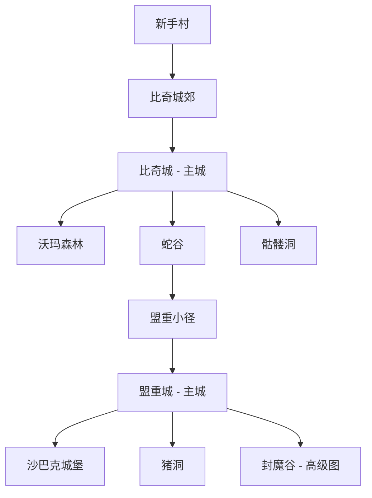

# 文字传奇WEB (WordCQ)

> 一款基于 Node.js + Express 的文字放置类 RPG 游戏，灵感来源于经典传奇系列网游

**当前版本**: v0.5.5（详见 `Backend/package.json`）  
**最后更新**: 2026-03-25

---

## 📖 项目简介

文字传奇是一款纯后端驱动的文字放置 RPG 游戏，玩家通过浏览器界面进行游戏，所有游戏逻辑运行在 Node.js 服务器上。游戏采用经典的传奇世界观，包含多职业系统、装备掉落、技能学习、地图探索等核心玩法。

### 技术栈

- **后端**: Node.js (ES Module) + Express 4.x
- **前端**: 原生 JavaScript + CSS Grid
- **数据存储**: JSON 文件存储（支持热加载）
- **运行模式**: 单服务器 + 静态文件服务

---

## 🏗️ 项目结构

```
WordCQ/
├── Backend/                 # 后端主程序
│   ├── data/               # 游戏数据配置
│   │   ├── gameConfig.json     # 核心配置（职业/技能/地图等）
│   │   ├── monsterDrops.json   # 怪物掉落表
│   │   ├── equipments.json     # 装备数据库
│   │   ├── skills.json         # 技能数据库
│   │   └── save.json           # 玩家存档数据
│   ├── src/                # 源代码
│   │   ├── server.js           # HTTP 服务器 + API 路由
│   │   ├── gameEngine.js       # 核心游戏引擎（战斗/成长系统等）
│   │   ├── dropSystem.js       # 掉落系统（概率计算/品质生成）
│   │   └── testDrops.js        # 掉落测试工具
│   ├── public/             # 前端静态资源
│   │   ├── index.html          # 主页面
│   │   ├── app.js              # 前端游戏逻辑
│   │   └── styles.css          # 样式表
│   ├── package.json        # 项目依赖配置
│   └── package-lock.json   # 依赖锁定文件
├── Docs/                   # 项目文档
│   └── Readme.md           # 项目说明文档
├── .lingma/                # IDE 配置
└── start.bat               # Windows 快速启动脚本
```

---

## 🎮 核心系统设计

### 1. 职业系统

游戏提供三个经典职业，每个职业有独特的属性成长和职业技能：

#### 战士 (Warrior)
- **定位**: 近战物理输出，高血量高防御
- **基础属性**: HP 120 / ATK 8 / DEF 5 / MP 40
- **成长系数**: HP+12 / ATK+3 / DEF+2 / MP+1 每级
- **代表技能**: 烈火剑法、半月弯刀、刺杀剑术

#### 法师 (Mage)
- **定位**: 远程魔法输出，高攻击低防御
- **基础属性**: HP 95 / Magic 10 / DEF 4 / MP 90
- **成长系数**: HP+8 / Magic+4 / DEF+1 / MP+4 每级
- **代表技能**: 火球术、雷电术、冰咆哮、火墙

#### 道士 (Taoist)
- **定位**: 辅助型角色，均衡发展的召唤师
- **基础属性**: HP 110 / Tao 9 / DEF 4 / MP 70
- **成长系数**: HP+10 / Tao+4 / DEF+1 / MP+3 每级
- **代表技能**: 施毒术、灵魂火符、召唤神兽

---

### 2. 地图系统

游戏包含多个 interconnected 的地图区域，形成完整的游戏世界：

#### 地图结构


#### 地图机制

**进入条件**:
- `minLevel`: 最低等级要求（如骷髅洞需要 Lv.6）
- `mapClear`: 需要通关前置地图（如盟重城需要先通关蛇谷）
- `recommendPower`: 推荐战力值参考

**地图属性**:
- `isTown`: 是否为安全区（城镇内无法战斗）
- `returnTownId`: 回城卷轴返回的目标城镇
- `monsterAtkMul`: 怪物攻击力倍率（新手村为 0.65 降低难度）
- `exits`: 方向出口（up/down/left/right 连接其他地图）

**怪物刷新**:
- 每张地图有独立的怪物池，按 `weight` 权重随机刷新
- 部分地图有固定 Boss（权重制，非必出）
- 精英怪机制：5% 概率刷新精英怪（HP×1.6, ATK×1.25, DEF×1.2）

#### 主要地图列表

| 地图 ID | 名称 | 类型 | 推荐等级 | 主要怪物 |
|--------|------|------|---------|----------|
| novice_village | 新手村 | 战斗 | 1 级 | 鸡、鹿、稻草人 |
| bichi_outskirts | 比奇城郊 | 战斗 | 3 级 | 钉耙猫、多钩猫、半兽人 |
| skeleton_cave | 骷髅洞 | 战斗 | 6 级 | 骷髅战士、骷髅精灵 (Boss) |
| wooma_forest | 沃玛森林 | 战斗 | 8 级 | 沃玛战士、沃玛教主 (Boss) |
| snake_valley | 蛇谷 | 战斗 | 10 级 | 红蛇、虎蛇 |
| mengzhong_path | 盟重小径 | 战斗 | 12 级 | 狼、沙虫、盔甲虫 |
| zombie_cave | 僵尸洞 | 战斗 | 18 级 | 僵尸、尸王 (Boss) |
| fengmo_valley | 封魔谷 | 战斗 | 25 级 | 虹魔教主、高级装备掉落 |

---

### 3. 怪物系统

#### 怪物分类

**普通怪物**: 基础练级对象，掉落一般
- 示例：鸡 (Lv.1)、骷髅 (Lv.7)、僵尸 (Lv.20)

**精英怪物**: 随机刷新，属性强化，掉落更好
- 外观标识：名字前缀"精英"
- 属性加成：HP×1.6 / ATK×1.25 / DEF×1.2

**Boss 怪物**: 固定刷新点，高难度高回报
- 示例：骷髅精灵 (Lv.12)、沃玛教主 (Lv.18)、尸王殿主 (Lv.28)
- 特性：血量大、攻击高、必掉好装备

#### 怪物属性

每个怪物包含以下字段：
```json
{
  "id": "skeleton_king",
  "name": "骷髅精灵",
  "level": 12,
  "hp": 180,
  "atk": 18,
  "def": 8,
  "exp": 35,
  "isBoss": true,
  "isRanged": false,
  "range": 1
}
```

#### 战斗机制

- **近战 vs 远程**: 怪物有 `isRanged` 标识，决定攻击范围
- **先手规则**: 玩家速度 vs 怪物速度对比决定谁先出手
- **伤害公式**: `(攻击方 ATK - 防守方 DEF) × 技能倍率`
- **暴击机制**: 部分技能和精英/Boss 有暴击加成

---

### 4. 掉落系统

#### 掉落类型

**金币掉落**:
- 所有怪物都会掉落金币
- 数量范围：`goldMin` ~ `goldMax`
- 示例：`{"goldMin": 3, "goldMax": 6}` → 掉落 3-6 金币

**物品掉落**:
- `equipId`: 固定装备 ID（如 `ring_snake_eye`）
- `itemStackId`: 堆叠物品 ID（如 `skill_fireball` 技能书）
- `chance`: 掉落概率（0.0005 = 0.05% ~ 0.3 = 30%）

#### 品质系统

装备品质分为 5 个等级，影响属性加成：

| 品质 | 颜色 | 属性加成 | 代表装备 |
|------|------|---------|----------|
| White | 白色 | +0 | 布衣、木剑 |
| Green | 绿色 | +3 | 青铜剑、皮甲 |
| Blue | 蓝色 | +5 | 战刃·蓝、重甲·蓝 |
| Purple | 紫色 | +7 | 炼狱·紫、战甲·紫 |
| Orange | 橙色 | +9 | 顶级装备 |

#### 品质生成规则

- **白装**: 基础属性，无加成
- **绿装及以上**: 基础属性 + 品质 bonus
- **HP 特殊加成**: 每点 bonus 转化为 5 点 HP

示例代码逻辑：
```javascript
finalStats.atk = baseAtk + bonus;  // bonus: white=0, green=3, blue=5...
finalStats.hpMax = baseHp + bonus * 5;
```

#### 地图掉落配置

每张地图可配置独立掉落规则：
```json
{
  "goldMin": 2,
  "goldMax": 7,
  "equipChance": 0.0013,      // 装备掉落概率
  "maxRarity": "blue",        // 最高品质限制
  "potionChance": 0.12        // 药水掉落概率
}
```

---

### 5. 装备系统

#### 装备部位

- `weapon`: 武器（增加攻击力/魔法力/道术）
- `armor`: 衣服（增加防御/血量）
- `helmet`: 头盔（增加防御/魔法抗性）
- `necklace`: 项链（综合属性）
- `ring`: 戒指 ×2（左右手各一个）
- `bracelet`: 手镯 ×2
- `shoes`: 鞋子（增加速度/防御）

#### 装备属性

每件装备包含：
- `baseStats`: 基础属性（atk/def/magic/tao/hpMax）
- `rarity`: 品质等级
- `levelRequirement`: 等级要求
- `slot`: 装备部位

#### 强化系统

- 使用金币强化装备
- 强化等级：+1 ~ +10
- 成功率随等级递减
- 失败不降级（保护机制）

---

### 6. 技能系统

#### 技能分类

**主动技能**:
- 需要消耗 MP
- 有施放范围 (`range`)
- 伤害倍率 (`dmgMul`)
- 示例：火球术 (MP 4, 范围 3, 1.15x)

**被动技能**:
- 不消耗 MP
- 永久增加属性
- 示例：基本剑术 (+1 ATK)、魔法掌握 (+1 Magic)

#### 学习与升级

- **学习等级**: 达到指定等级自动学会
- **熟练度**: 使用技能增加熟练度
- **技能等级**: Lv.1 → Lv.2 → Lv.3（需要熟练度阈值）
- **效果提升**: 高等级技能有更高伤害倍率

#### 技能书获取

- 怪物掉落（如僵尸掉《雷电术》）
- Boss 必掉高级技能书
- 使用技能书：背包右键点击学习

---

### 7. 商店系统

#### 城镇商店

每个城镇有不同的商品列表：

**新手村**:
- 小金创药 (25 金币)
- 小魔法药 (30 金币)
- 青铜剑 (120 金币，绿装)

**比奇城**:
- 中金创药 (90 金币)
- 中魔法药 (110 金币)
- 战刃 (260 金币，绿装)

**盟重城**:
- 大金创药 (220 金币)
- 大魔法药 (240 金币)
- 战刃·蓝 (680 金币，蓝装)

**封魔谷**:
- 顶级药水
- 紫色装备 (2600 金币起)

---

### 8. 仓库系统

- 主城可使用仓库功能
- 存储多余装备和物品
- 跨角色共享仓库（同账号）
- 容量限制：初始 20 格，可扩展

---

### 9. 自动挂机系统

#### 自动化功能

**自动喝药**:
- 设置 HP/MP 阈值（如低于 35% 自动喝药）
- 仅在城镇可购买药水时生效
- 优先使用背包中的药水

**自动穿戴**:
- 捡到装备自动比较战力
- 满足条件自动穿戴（分数更高）
- 可设置自动回收阈值

**自动回收**:
- 自动出售低品质装备
- 可设置回收品质阈值（如白装全部回收）
- 回收获得金币返还

#### 挂机逻辑

- 每 1.5 秒一个 tick（可配置）
- 自动选择目标怪物
- 自动释放技能（如有 MP）
- 自动拾取掉落物
- 离线挂机保护（最多 4 小时收益）

---

## 🔧 配置文件详解

### gameConfig.json

核心配置文件，包含：

```json
{
  "tickMs": 1500,                    // 游戏心跳间隔 (毫秒)
  "logMax": 300,                     // 日志最大条数
  "offlineMaxSeconds": 14400,        // 离线最大收益时间 (4 小时)
  "elite": {                         // 精英怪配置
    "chance": 0.05,                  // 刷新概率 5%
    "hpMul": 1.6,                    // HP 倍率
    "atkMul": 1.25,                  // 攻击倍率
    "defMul": 1.2                    // 防御倍率
  },
  "jobs": { ... },                   // 职业配置
  "skills": { ... },                 // 技能配置
  "maps": [ ... ],                   // 地图配置
  "shopByTown": { ... }              // 城镇商店配置
}
```

### monsterDrops.json

怪物掉落表：

```json
{
  "monsterDrops": {
    "wooma_boss": {
      "name": "沃玛教主",
      "level": 18,
      "isBoss": true,
      "drops": [
        {"goldMin": 50, "goldMax": 100},
        {"equipId": "weapon_ghoul", "chance": 0.2, "name": "井中月"},
        {"itemStackId": "skill_basic", "chance": 0.3, "name": "基础技能书"}
      ]
    }
  }
}
```

### save.json

玩家存档数据（自动生成）：

```json
{
  "accounts": { ... },               // 账号数据
  "players": [...],                  // 角色列表
  "runtime": {                       // 运行时状态
    "isRunning": false,              // 是否正在挂机
    "lastTickAt": 1234567890,        // 上次心跳时间
    "sessions": { ... }              // 登录会话
  },
  "logs": [...]                      // 游戏日志
}
```

---

## 🚀 运行与部署

### 环境要求

- Node.js >= 16.x (支持 ES Module)
- npm >= 7.x

### 安装步骤

```bash
# 1. 进入后端目录
cd Backend

# 2. 安装依赖
npm install

# 3. 启动开发服务器
npm run dev

# 4. 访问游戏
# 浏览器打开：http://localhost:3000
```

### Windows 快速启动

双击 `start.bat` 即可一键启动服务器。

### 生产环境部署

```bash
# 使用 PM2 守护进程
pm2 start Backend/src/server.js --name wordcq

# 或使用 nohup
nohup node Backend/src/server.js > wordcq.log 2>&1 &
```

---

## 🌐 API 接口概览

### 认证相关

- `POST /api/auth/register` - 注册新账号
- `POST /api/auth/login` - 登录
- `GET /api/auth/me` - 获取当前用户信息

### 角色管理

- `GET /api/players` - 获取角色列表
- `POST /api/players` - 创建新角色
- `PUT /api/players/:id` - 更新角色信息

### 游戏操作

- `POST /api/maps/:id/enter` - 进入地图
- `POST /api/fight/start` - 开始战斗
- `POST /api/items/use` - 使用物品
- `POST /api/skills/learn` - 学习技能
- `POST /api/shop/buy` - 购买物品

### 自动化设置

- `PUT /api/settings/auto-equip` - 自动穿戴开关
- `PUT /api/settings/auto-recycle` - 自动回收开关
- `PUT /api/settings/auto-drink` - 自动喝药设置

---

## 📊 游戏数值体系

### 等级经验曲线

```
Lv.1-10:  每级需要 exp = level × 100
Lv.11-20: 每级需要 exp = level × 200
Lv.21-30: 每级需要 exp = level × 400
Lv.31+:   每级需要 exp = level × 800
```

### 属性成长公式

**战士**:
```
HP = 120 + (level - 1) × 12
ATK = 8 + (level - 1) × 3
DEF = 5 + (level - 1) × 2
```

**法师**:
```
HP = 95 + (level - 1) × 8
Magic = 10 + (level - 1) × 4
DEF = 4 + (level - 1) × 1
```

**道士**:
```
HP = 110 + (level - 1) × 10
Tao = 9 + (level - 1) × 4
DEF = 4 + (level - 1) × 1
```

### 伤害计算公式

```
基础伤害 = 攻击方 ATK - 防守方 DEF
技能伤害 = 基础伤害 × 技能 dmgMul
最终伤害 = max(技能伤害，1)  // 保证至少造成 1 点伤害
```

---

## 🛠️ 开发与维护

### 添加新地图

1. 在 `gameConfig.json` 的 `maps` 数组中添加新地图
2. 配置 `exits` 连接到现有地图网络
3. 设置 `monsters` 怪物池和权重
4. （可选）配置 `drops` 掉落规则

### 添加新怪物

1. 在 `monsterDrops.json` 中添加怪物条目
2. 配置 `drops` 数组定义掉落物品
3. 在对应地图的 `monsters` 中引用怪物 ID

### 添加新装备

1. 在 `equipments.json` 的对应类别添加
2. 设置 `baseStats` 基础属性
3. 配置 `rarity` 品质和 `levelRequirement` 等级要求
4. 添加到怪物掉落表或商店列表

### 数值平衡调整

- 修改 `gameConfig.json` 中的职业成长系数
- 调整 `monsterDrops.json` 中的掉落概率
- 修改技能 `dmgMul` 倍率

---

## ⚠️ 注意事项

### 数据备份

- 定期备份 `Backend/data/save.json`
- 修改配置前备份 `gameConfig.json`
- 使用 Git 进行版本控制

### 性能优化

- 日志条数限制在 `logMax` 以内
- 离线挂机时间不超过 `offlineMaxSeconds`
- 大量物品时启用自动回收

### 兼容性

- 项目使用 ES Module，脚本需使用 `import` 语法
- 禁止在 JSON 配置文件中添加注释
- PowerShell 路径处理需注意转义字符

---

## 📝 更新日志

### v0.5.5 (2026-03-25)
- ✅ 完善怪物，装备系统

### v0.3.3 (2026-03-25)
- ✅ 修复药水图标显示不一致问题
- ✅ 优化装备对比窗口 UI
- ✅ 修正 CSS 空规则集警告

### v0.3.0 (2026-03)
- ✅ 新增封魔谷地图
- ✅ 添加紫色品质装备
- ✅ 优化自动回收系统

### v0.2.0 (2026-02)
- ✅ 新增盟重城地图
- ✅ 添加 Boss 怪物系统
- ✅ 实装技能熟练度系统

### v0.1.0 (2026-01)
- ✅ 初始版本发布
- ✅ 基础战斗系统
- ✅ 职业系统和等级成长

---

## 📄 许可证

本项目仅供学习和研究使用。

---

## 👥 开发团队

- **主程**: SD5212146 / Hua Miller
- **UI**: SD5212146 / Hua Miller
- **策划**: SD5212146 / Hua Miller

---

## 🎯 未来计划

- [ ] 多人在线对战系统
- [ ] 行会/沙巴克攻城战
- [ ] 更多高级地图和 Boss
- [ ] 装备锻造系统
- [ ] 宠物系统
- [ ] 跨服竞技

---

**最后更新日期**: 2026-03-25
